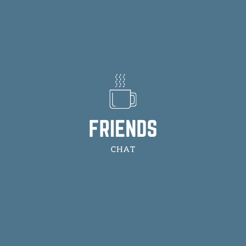

# Friends Chat



## Sobre o projeto

É uma aplicação web de envio de mensagens em tempo real. Nesta aplicação é possivel a criação de salas de bate papo com nome e 
número maximo de participantes personalizáveis.A aplicação utiliza websockets atravéz da biblioteca Socket.io para o envio e 
recebimento de mensagens e também para a ativação de eventos como a listagem de salas.

O projeto está disponível [aqui](https://friendschat.netlify.app).

## Porque desenvolvi esta aplicação?

Fiz esta aplicação para evoluir no estudos de nodejs. O principal objetivo dessa aplicação foi aprender a trabalhar com socket. 
Durante o desenvolvimento dessa palicação eu treinei:

- POO
- Sockets

## Socket Eventos da aplicação🎬

|Nome       | Dados                                                    | Descrição                                     | 
|-----------|----------------------------------------------------------|-----------------------------------------------|
|connect    | none                                                     | Adiciona o usuário à lista de usuários        |
|diconnect  | none                                                     | Quando um socket desconecta ele será excluido da sala que participa e caso seja a única pessoa na sala ela será excluida |
|sentmesage | ```{"room": string, "mesage": string, "name": string}``` | Envio de mensagens                            |
|getrooms   | none                                                     | Listar salas                                  |
|joinroom   | ```{"room": string}```                                   | Entrar na sala                                |
|leftroom   | ```{"room": string}```                                   | Sair na sala                                  |
|createroom | ```{"name": string, "max": number}```                    | Criar sala                                    |
|sentmesage | ```{"room": string, "mesage": string, "name": string}``` | Envio de mensagens                            |

## Minhas redes🌐

[](https://www.linkedin.com/in/paulo-gabriel-605687171/)
